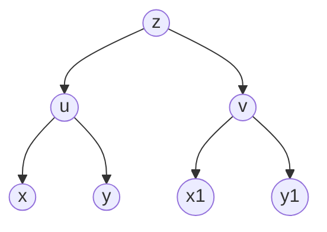

# 第八章 多元函数微分学

## 多元函数的基本概念

   #### 多元函数的极限

$$
\lim_{(x,y) \to (x_0,y_0)}f(x,y)=A
$$

### 多元函数的连续性

$$
\lim_{(x,y) \to (x_0,y_0)}f(x,y) = f(x_0,y_0)
$$

**最值定理**：有界闭区域$D$上的连续函数在区域$D$上必能取得最大值与最小值

**介值定理**：有界闭区域$D$上的连续函数在区域$D$上必能取得介于最大值与最小值之间的任何值  

### 偏导数

二元函数在某点的偏导数可以看作一元函数的导数，“先代后求”，带入不求偏导的变量的值
$$
\begin{aligned}
&f_{x}\left(x_{0}, y_{0}\right)=\lim _{\Delta x \rightarrow 0} \frac{f\left(x_{0}+\Delta x, y_{0}\right)-f\left(x_{0}, y_{0}\right)}{\Delta x}=\left.\frac{\mathrm{d}}{\mathrm{d} x} f\left(x, y_{0}\right)\right|_{x=x_{0}} \\
&f_{y}\left(x_{0}, y_{0}\right)=\lim _{\Delta y \rightarrow 0} \frac{f\left(x_{0}, y_{0}+\Delta y\right)-f\left(x_{0}, y_{0}\right)}{\Delta y}=\left.\frac{\mathrm{d}}{\mathrm{d} y} f\left(x_{0}, y\right)\right|_{y=y_{0}}
\end{aligned}
$$

高阶偏导数：$$\cfrac{\partial}{\partial x}\left(\cfrac{\partial z}{\partial x}\right)=\cfrac{\partial^{2} z}{\partial x^{2}}=f_{x x}^{\prime \prime}\quad  \cfrac{\partial}{\partial y}\left(\cfrac{\partial z}{\partial x}\right)=\cfrac{\partial^{2} z}{\partial x \partial y}=f_{x y}^{\prime \prime} \quad \cfrac{\partial}{\partial x}\left(\cfrac{\partial z}{\partial y}\right)=\cfrac{\partial^{2} z}{\partial y \partial x}=f_{y x}^{\prime \prime} $$

如果函数$z=f(x,y)$的两个二阶混合偏导数在某点或某区域内连续，则有$\cfrac{\partial^{2} z}{\partial x \partial y}=\cfrac{\partial^{2} z}{\partial y \partial x}$

### 全微分

**1）定义**

若$\Delta z=f(x_0+\Delta x,y_0+\Delta y)-f(x_0,y_0)=A\Delta x+ B\Delta y +o\left(\sqrt{(\Delta x)^2+(\Delta y)^2}\right)$，则称函数$z=f(x,y)$在$(x_0,y_0)$处可微，微分为$\mathrm{d}z=A\Delta x+ B\Delta y$

**2）可微的必要条件**

如果函数$z=f(x,y)$在$(x_0,y_0)$处可微，则在$(x_0,y_0)$处$\cfrac{\partial z}{\partial x},\cfrac{\partial z}{\partial y}$必定存在，且$\mathrm{d}z=\cfrac{\partial z}{\partial x}\mathrm{d}x +\cfrac{\partial z}{\partial y}\mathrm{d}y$。但是可导并不一定可微！

**3）判断可微性**

a）用定义判断可微性：

1. $f_x(x_0,y_0)$与$f_y(x_0,y_0)$是否都存在？
2. $\displaystyle\lim _{(\Delta x, \Delta y) \rightarrow(0,0)} \cfrac{\Delta z-\left[f_{x}\left(x_{0}, y_{0}\right) \Delta x+f_{y}\left(x_{0,} y_{0}\right) \Delta y\right]}{\sqrt{(\Delta x)^{2}+(\Delta y)^{2}}}$是否为零？

b）用可微的充分条件判断可微性：

如果函数$z=f(x,y)$的偏导数$\cfrac{\partial z}{\partial x},\cfrac{\partial z}{\partial y}$存在且在点在$(x_0,y_0)$处连续，则函数$z=f(x,y)$在$(x_0,y_0)$处可微

### 连续、可导、可微的关系

## 多元函数微分法

### 复合函数微分法

设$u=u(x,y),v=v(x,y)$在点$(x,y)$处有对$x$和$y$的偏导数，函数$z=f(u,v)$在对应点$(u,v)$有连续偏导数，则函数$z=f(u,v)$在$(x,y)$处的两个偏导数存在，且有：
$$
\frac{\partial z}{\partial x}=\frac{\partial z}{\partial u} \frac{\partial u}{\partial x}+\frac{\partial z}{\partial v} \frac{\partial v}{\partial x} \\ \frac{\partial z}{\partial y}=\frac{\partial z}{\partial u} \frac{\partial u}{\partial y}+\frac{\partial z}{\partial v} \frac{\partial v}{\partial y}
$$

**全微分形式的不变性**

设$u=u(x,y),v=v(x,y),z=f(u,v)$都有连续的一阶偏导数，则复合函数的全微分：
$$
\mathrm{d}z=\cfrac{\partial z}{\partial x}\mathrm{d}x+\cfrac{\partial z}{\partial y}\mathrm{d}y=\cfrac{\partial z}{\partial u}\mathrm{d}u+\cfrac{\partial z}{\partial v}\mathrm{d}v
$$

### 隐函数微分法

**1）由方程$F(x,y)=0$确定的隐函数$y=y(x)$**
$$
y'=-\cfrac{F'_x}{F'_y}
$$
**2）由方程$F(x,y,z)=0$确定的隐函数$z=z(x,y)$**

若$F'_z(x,y,z) \ne 0$，则方程唯一确定一个有连续偏导的函数$z=z(x,y)$，且有：
$$
\cfrac{\partial z}{\partial x} =-\cfrac{F'_x}{F'_z} \\
\cfrac{\partial z}{\partial y} =-\cfrac{F'_y}{F'_z}
$$

## 多元函数的极值与最值

### 无约束极值

#### 极值的必要条件

设$z=f(x,y)$在点$(x_0,y_0)$处存在偏导数，且$(x_0,y_0)$为$z=f(x,y)$的极值点，则
$$
f'_x(x_0,y_0)=0,f'_y(x_0,y_0)=0
$$

#### 极值的充分条件

设$z=f(x,y)$在点$(x_0,y_0)$的某邻域内有二阶连续偏导数，又$f'_x(x_0,y_0)=0,f'_y(x_0,y_0)=0$，记$A=f''_{xx}(x_0,y_0),B=f''_{xy}(x_0,y_0),C=f''_{yy}(x_0,y_0)$，则：

1. 当$AC-B^2>0$时，有极值$\left\{\begin{array}{l}A>0 \text{极小值}\\ A<0\text{极大值}\end{array}\right.$ 
2. 当$AC-B^2<0$时，无极值
3. 当$AC-B^2=0$时，不一定（一般用定义判定）

### 条件极值与拉格朗日乘数法

函数$f(x,y)$在条件$\varphi(x,y)=0$下的极值

令$F(x,y,\lambda)=f(x,y)+\lambda \varphi(x,y)$
$$
\left\{\begin{array}{l}
F_{x}=f_{x}^{\prime}(x, y)+\lambda \varphi_{x}^{\prime}(x, y)=0 \\
F_{y}=f_{y}^{\prime}(x, y)+\lambda \varphi_{y}^{\prime}(x, y)=0 \\
F_{\lambda}=\varphi(x, y)=0
\end{array}\right.
$$
若有多个条件就加拉格朗日因子，这部分可看[博客](https://blogyun.2bwant2b.com/2021/02/23/博客/学习笔记/拉格朗日乘数法/)中的相关内容

### 最大最小值

求连续函数$f(x,y)$在有界闭区域$D$上的最值

1. 求$f(x,y)$在区域$D$内部可能的极值点
2. 求$f(x,y)$在区域$D$边界上的最大最小值（将边界方程带入函数中在根据边界范围求OR拉格朗日乘数法OR对椭圆圆形边界写成参数方程更好求）
3. 比较极值与边界最值

这里和[KKT条件](https://blogyun.2bwant2b.com/2021/02/23/博客/学习笔记/Karush-Kuhn-Tucker-KKT-条件/)似乎是差不多的
